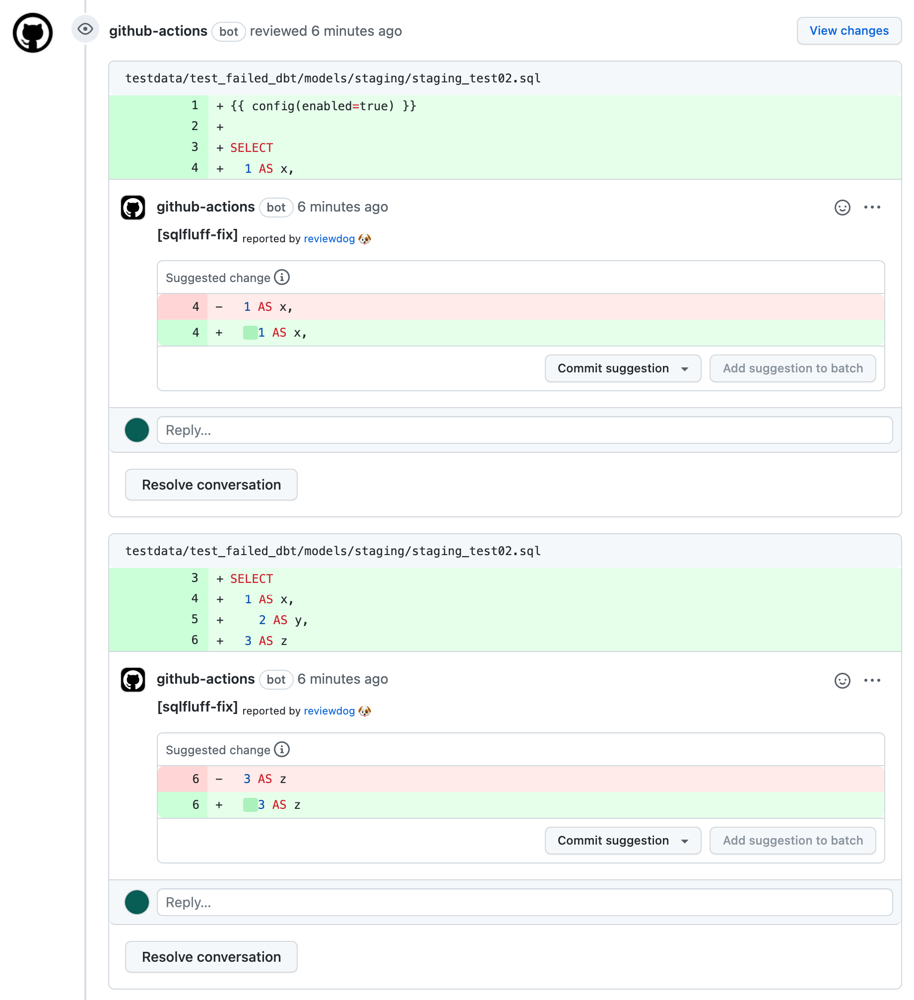

# action-sqlfluff

<!-- TODO: replace reviewdog/yu-iskw/action-sqlfluff with your repo name -->

[](https://github.com/yu-iskw/action-sqlfluff/actions?query=workflow%3ATest)
[](https://github.com/yu-iskw/action-sqlfluff/actions?query=workflow%3Areviewdog)
[](https://github.com/yu-iskw/action-sqlfluff/actions?query=workflow%3Adepup)
[](https://github.com/yu-iskw/action-sqlfluff/actions?query=workflow%3Arelease)
[](https://github.com/yu-iskw/action-sqlfluff/releases)
[](https://github.com/haya14busa/action-bumpr)

This is a github action to lint and fix SQL with [sqlfluff](https://github.com/sqlfluff/sqlfluff).
The action has the two modes corresponding to `sqlfluff lint` and `sqlfluff fix`.
One is to automatically leaves comments about SQL violation using [reviewdog](https://github.com/reviewdog/reviewdog)
The other is to automatically suggests code formatting on github pull request with reviewdog too.

## Lint mode

The lint mode leaves comments on github pull requests.
Comments are pointed out by sqlfluff.


## Fix mode

The fix mode suggests code formatting based on `sqlfluff fix`.


## Example

```yaml
name: sqlfluff with reviewdog
on:
  pull_request:
jobs:
  test-check:
    name: runner / sqlfluff (github-check)
    runs-on: ubuntu-latest
    steps:
      - uses: actions/checkout@v4
      - uses: yu-iskw/action-sqlfluff@v4
        id: lint-sql
        with:
          github_token: ${{ secrets.github_token }}
          reporter: github-pr-review
          sqlfluff_version: "3.2.5"
          sqlfluff_command: "fix" # Or "lint"
          config: "${{ github.workspace }}/.sqlfluff"
          paths: "${{ github.workspace }}/models"
      - name: "Show outputs (Optional)"
        shell: bash
        run: |
          echo '${{ steps.lint-sql.outputs.sqlfluff-results }}' | jq -r '.'
          echo '${{ steps.lint-sql.outputs.sqlfluff-results-rdjson }}' | jq -r '.'
```

## Input

```yaml
inputs:
  github_token:
    description: "GITHUB_TOKEN"
    required: true
    default: "${{ github.token }}"
  github_base_ref:
    description: "Pull request target branch name"
    required: false
    default: "${{ github.base_ref }}"
  working-directory:
    description: "working directory"
    required: false
    default: "${{ github.workspace }}"
  ### Flags for reviewdog ###
  level:
    description: "Report level for reviewdog [info,warning,error]"
    required: false
    default: "error"
  reporter:
    description: "Reporter of reviewdog command [github-check,github-pr-review]."
    required: false
    default: "github-check"
  filter_mode:
    description: |
      Filtering mode for the reviewdog command [added,diff_context,file,nofilter].
      Default is file.
    required: false
    default: "file"
  fail_on_error:
    description: |
      Exit code for reviewdog when errors are found [true,false]
      Default is `false`.
    required: false
    default: "false"
  reviewdog_version:
    description: "reviewdog version"
    required: false
    default: "v0.20.2"
  ### Flags for sqlfluff ###
  sqlfluff_version:
    description: |
      sqlfluff version. Use the latest version if not set.
    required: false
    default: "3.2.5"
  sqlfluff_command:
    description: "The sub command of sqlfluff. One of lint and fix"
    required: false
    default: "lint"
  paths:
    description: |
      PATH is the path to a sql file or directory to lint.
      This can be either a file ('path/to/file.sql'), a path ('directory/of/sql/files'), a single ('-') character to indicate reading from *stdin* or a dot/blank ('.'/' ') which will be interpreted like passing the current working directory as a path argument.
    required: true
  file_pattern:
    description: "The regular expression to filter checked files"
    required: false
    default: '\.sql$'
  encoding:
    description: "Specifiy encoding to use when reading and writing files. Defaults to autodetect."
    required: false
    default: ""
  config:
    description: |
      Include additional config file.
      By default the config is generated from the standard configuration files described in the documentation.
      This argument allows you to specify an additional configuration file that overrides the standard configuration files.
      N.B. cfg format is required.
    required: false
    default: ""
  exclude-rules:
    description: |
      Exclude specific rules.
      For example specifying –exclude-rules L001 will remove rule L001 (Unnecessary trailing whitespace) from the set of considered rules.
      This could either be the allowlist, or the general set if there is no specific allowlist.
      Multiple rules can be specified with commas e.g. –exclude-rules L001,L002 will exclude violations of rule L001 and rule L002.
    required: false
    default: ""
  rules:
    description: |
      Narrow the search to only specific rules.
      For example specifying –rules L001 will only search for rule L001 (Unnecessary trailing whitespace).
      Multiple rules can be specified with commas e.g. –rules L001,L002 will specify only looking for violations of rule L001 and rule L002.
    required: false
    default: ""
  templater:
    description: "The templater to use"
    required: false
    default: ""
  disable-noqa:
    description: "Set this flag to ignore inline noqa comments."
    required: false
    default: ""
  dialect:
    description: "The dialect of SQL to lint"
    required: false
    default: ""
  processes:
    description: "The number of parallel processes to run."
    required: false
    default: "2"
  extra_requirements_txt:
    description: |
      A path to your custom `requirements.txt` to install extra modules for your dbt adapters.
      Please make sure not to contain `sqlfluff` and its dependent packages, because the action can be broken by the conflicts.
    required: false
    default: ""
```

## Outputs

The outputs are available only when the `sqlfluff_command` input is `lint`.

```yaml
outputs:
  sqlfluff-results:
    description: "The JSON object string of sqlfluff results"
    value: ${{ steps.sqlfluff-with-reviewdog-in-composite.outputs.sqlfluff-results }}
  sqlfluff-exit-code:
    description: "The exit code of sqlfluff"
    value: ${{ steps.sqlfluff-with-reviewdog-in-composite.outputs.sqlfluff-exit-code }}
  sqlfluff-results-rdjson:
    description: "The JSON object string of sqlfluff results"
    value: ${{ steps.sqlfluff-with-reviewdog-in-composite.outputs.sqlfluff-results-rdjson }}
  reviewdog-return-code:
    description: "The exit code of reviewdog"
    value: ${{ steps.sqlfluff-with-reviewdog-in-composite.outputs.reviewdog-return-code }}
```

## Development

### Release

#### [haya14busa/action-bumpr](https://github.com/haya14busa/action-bumpr)

You can bump version on merging Pull Requests with specific labels (bump:major,bump:minor,bump:patch).
Pushing tag manually by yourself also work.

#### [haya14busa/action-update-semver](https://github.com/haya14busa/action-update-semver)

This action updates major/minor release tags on a tag push. e.g. Update v1 and v1.2 tag when released v1.2.3.
ref: <https://help.github.com/en/articles/about-actions#versioning-your-action>

### Lint - reviewdog integration

This reviewdog action template itself is integrated with reviewdog to run lints
which is useful for Docker container based actions.


Supported linters:

- [reviewdog/action-shellcheck](https://github.com/reviewdog/action-shellcheck)
- [reviewdog/action-hadolint](https://github.com/reviewdog/action-hadolint)
- [reviewdog/action-misspell](https://github.com/reviewdog/action-misspell)

### Dependencies Update Automation

This repository uses [reviewdog/action-depup](https://github.com/reviewdog/action-depup) to update
reviewdog version.


## Contributors

<!-- readme: contributors -start -->
<table>
	<tbody>
		<tr>
            <td align="center">
                <a href="https://github.com/yu-iskw">
                    
                    <br />
                    <sub><b>Yu Ishikawa</b></sub>
                </a>
            </td>
            <td align="center">
                <a href="https://github.com/vgw-chriskruger">
                    
                    <br />
                    <sub><b>Chris Kruger</b></sub>
                </a>
            </td>
            <td align="center">
                <a href="https://github.com/onesuper">
                    
                    <br />
                    <sub><b>Dreamsome</b></sub>
                </a>
            </td>
            <td align="center">
                <a href="https://github.com/snyk-bot">
                    
                    <br />
                    <sub><b>Snyk Bot</b></sub>
                </a>
            </td>
            <td align="center">
                <a href="https://github.com/kieronellis">
                    
                    <br />
                    <sub><b>Null</b></sub>
                </a>
            </td>
		</tr>
	<tbody>
</table>
<!-- readme: contributors -end -->
